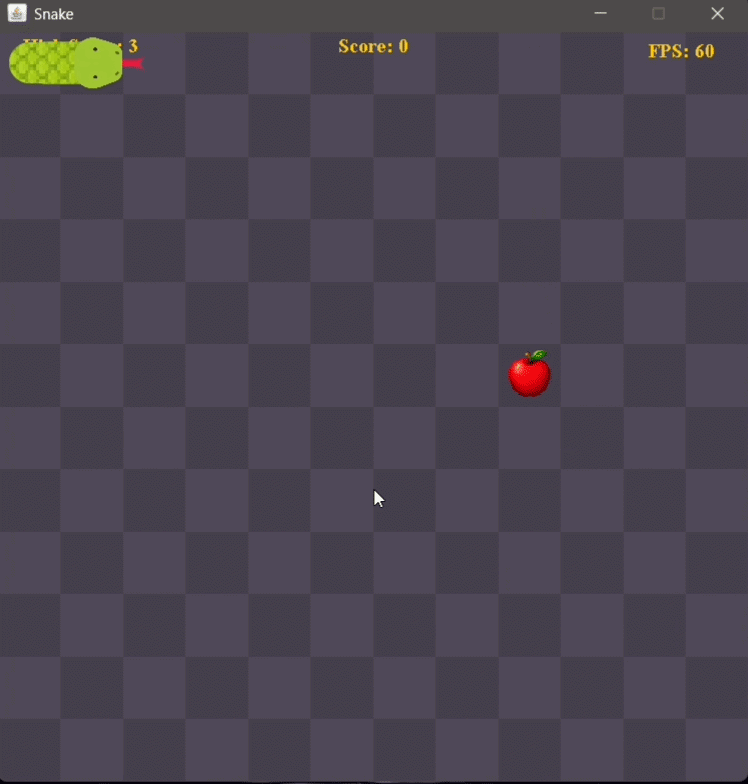

# Snake Game 🐍

<p align="center">
  
</p>

> A **Java Swing** version of the classic **Snake game**. <br>
> The player controls a snake, collects apples, avoids crashing into the walls or itself, and tries to get the highest score possible.

## ✨ Features

* 🎮 Main menu with **Easy**, **Medium**, and **Hard** difficulty modes.
* 🐍 Smooth animated snake movement using interpolation between previous & current positions.
* 🎨 Custom snake textures, apple sprites, and a themed background.
* 🔊 Sound effects for movement, apple collection, menu interactions, and Game Over.
* 🍎 Three apple types:
  * **Regular** (+1 point)
  * **Golden** (+3 points)
  * **Poison** (-2 points and removes one body segment)
* ⏱ Poison apples disappear after 7 seconds if left uncollected.
* ⚡ The snake's movement speed gradually increases as the score grows.
* 🏆 Current score and session high score tracking.
* ⏸ Pause and resume with the **P** key.
* 🔄 Restart button after Game Over.
* 📈 FPS counter for performance monitoring.

---

## 🎮 Controls

| Key     | Action         |
| ------- | -------------- |
| ↑ ↓ ← → | Move the snake |
| **P**   | Pause / Resume |

---

## 🚀 Running the Game

Clone the repository and open it in your preferred Java IDE (such as IntelliJ IDEA, Eclipse, or VS Code).

Run the main class:

```text
src/snake/SnakeGame.java
```

Alternatively, from the project directory:

```powershell
javac -encoding UTF-8 -d bin (Get-ChildItem -Path src -Recurse -Filter *.java).FullName
java -cp bin snake.SnakeGame
```

---

## 🏗 Project Structure

```text
src/
├── apple/        Apple models, spawning logic and apple types
├── config/       Game configuration and constants
├── controller/   Input handling and gameplay logic
├── difficulty/   Strategy pattern implementation for difficulties
├── images/       Game sprites and textures
├── model/        Snake and movement classes
├── render/       Rendering, image loading and audio management
├── sounds/       Sound effects
├── ui/           Swing window and game panel
└── snake/        Application entry point
```

---

## 🛠 Architecture

The project follows an object-oriented structure with a clear separation of responsibilities.

* **GameController** – Handles gameplay, movement, collisions, scoring, pause, restart and apple interactions.
* **GameRender** – Draws the snake, apples, UI, score, FPS counter and game states.
* **GameFrame** – Creates the main window and difficulty menu.
* **GamePanel** – Runs the game loop and updates the display.
* **ImageManager** – Loads image assets once and reuses them to improve rendering performance.
* **SoundManager** – Loads and manages sound effects.
* **DifficultyBehaviour** – Uses the **Strategy Design Pattern** to provide different difficulty implementations.

---

## ⚙ Customization

Most gameplay settings can be modified inside **GameConfig**, including:

* Board dimensions
* Grid size
* Initial snake length
* Speed scaling
* Poison apple lifetime

Game assets can also be easily replaced:

* Snake textures (`src/images/`)
* Apple sprites (`src/images/`)
* Menu background (`src/images/`)
* Sound effects (`src/sounds/`)

---

## 📚 Technical Highlights

This project was developed to practice Java game development and object-oriented design.

Some of the techniques used include:

* Strategy Design Pattern
* Separation of rendering and game logic
* Smooth movement interpolation
* Resource caching for images and sounds
* Modular project structure
* Java Swing rendering and event handling

---

## 📝 Notes

To improve performance, all images and audio are loaded once during initialization and reused throughout the game instead of being loaded every frame.
